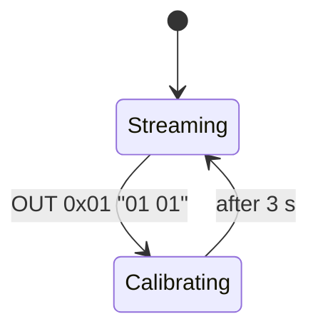

# Eidon Sim · HID Protocol Specification

This document is the authoritative reference for USB HID traffic between the Eidon Sim web‑app and two device classes:

* **Glove** ( PID 0x0001 ) — IMU + 16‑finger sensors
* **Tracker** ( PID 0x0002 ) — IMU only

All devices share Vendor ID **0xE1D0**.

---

## 1  Descriptors (v1.0)

### 1.1  Top‑level summary

| Field                | Glove                             | Tracker |
| -------------------- | --------------------------------- | ------- |
| **USB class**        | 0x03 (HID)                        | 0x03    |
| **Max packet**       | 64 B                              | 64 B    |
| **Report IDs**       | 0x01 (IN + OUT)  • 0x02 (Feature) | same    |
| **Polling interval** | 1 ms                              | 1 ms    |

The app filters devices with:

```js
navigator.hid.requestDevice({
  filters:[
    { vendorId:0xE1D0, productId:0x0001 },
    { vendorId:0xE1D0, productId:0x0002 }
  ]
});
```

### 1.2  Report ID 0x01 — **Quaternion + Data** (IN)

| Offset | Bytes | Glove field         | Tracker field | Notes                                                        |
| ------ | ----- | ------------------- | ------------- | ------------------------------------------------------------ |
| 0      | 2     | q<sub>i</sub>       | q<sub>i</sub> | little‑endian u16                                            |
| 2      | 2     | q<sub>j</sub>       | q<sub>j</sub> |                                                              |
| 4      | 2     | q<sub>k</sub>       | q<sub>k</sub> |                                                              |
| 6      | 2     | q<sub>w</sub>       | q<sub>w</sub> |                                                              |
| **8**  | **2** | 16‑bit button flags | 2‑bit flags   | bit 0 = side (0 L / 1 R) ; bit 1 = level (0 upper / 1 lower) |
| 10     | 16    | **Finger\[0‑15]**   | —             | 8‑bit angle each (0 flat … 255 bent)                         |
| 26–63  | —     | reserved (0)        | —             | packets always 64 B, unused = 0                              |

Quaternion decode:

```ts
const u16 = view.getUint16(off, true);
const f   = (u16 / 32767) - 1.0; // range [-1,1]
```

### 1.3  Report ID 0x01 — **Calibrate** (OUT)

Payload `01 01` starts a static calibration on device flash. Timing:

1. Host sends report.
2. Device flashes LED for 3 s while averaging quats.
3. Device resumes normal streaming.

The app issues this on **Calibrate All** and on per‑device ↻ buttons.

### 1.4  Report ID 0x02 — **RGB Colour** (Feature)

3‑byte payload `[R, G, B]` persists through power cycle; value appears as LED strip colour.

* **GET** feature → current colour.
* **SET** feature → update & store to EEPROM.

Example:

```js
// read
const data = await device.receiveFeatureReport(0x02, 3);
// write teal
await device.sendFeatureReport(0x02, Uint8Array.of(0x00,0xff,0xff));
```

---

## 2  State Machine



If the HID interface stalls, the device auto‑reboots after 5 s.

---

## 3  Error Handling / Edge Cases

| Condition                   | Device behaviour            | Host expectation                          |
| --------------------------- | --------------------------- | ----------------------------------------- |
| Descriptor version mismatch | sets bit 15 in button flags | warn user, allow continue (math may fail) |
| Quaternion norm ≠ 1 ±0.05   | device renormalises         | host still renormalises as safety         |
| Finger sensor offline       | sends 0xFF for that byte    | render as undefined (grey bar)            |

---

## 4  Descriptor Hex Listing

### 4.1  Glove

```text
05 01 09 05 a1 01 85 01 ... (full 94 bytes, see firmware)
```

### 4.2  Tracker

```text
05 20 09 80 a1 01 85 01 ... (full 62 bytes)
```

---

## 5  Revision History

| Rev | Date       | Notes                                 |
| --- | ---------- | ------------------------------------- |
| 1.0 | 2025‑05‑25 | Initial frozen spec for Eidon Sim 0.2 |

---

*Last updated : 2025‑05‑25*
